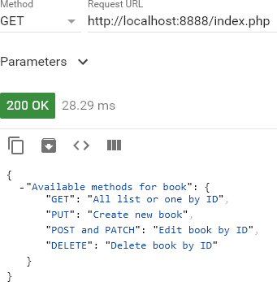
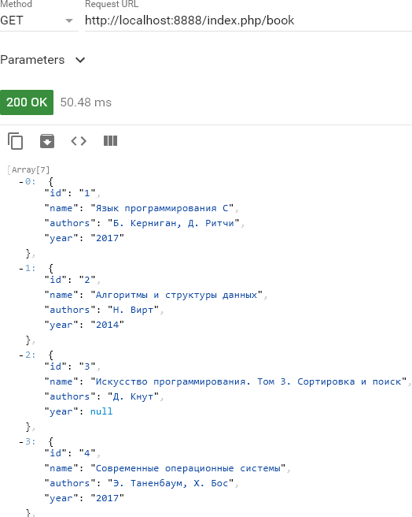
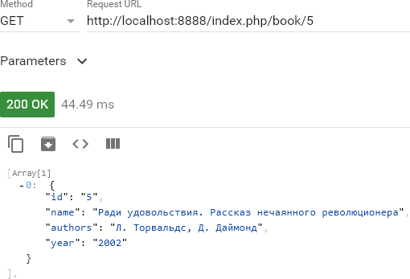
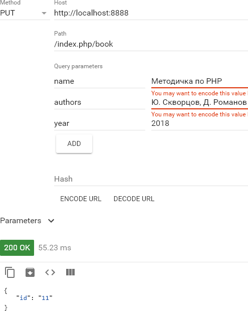
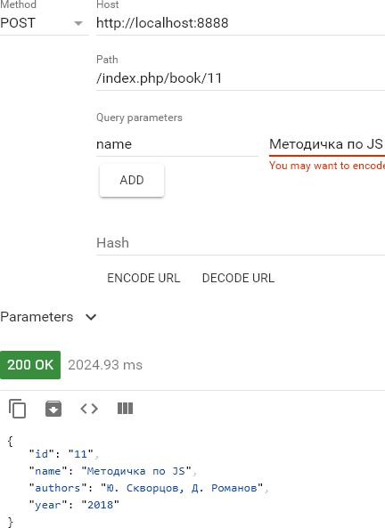
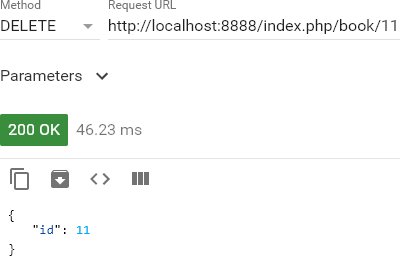

# Постановка задачи

Разработать RESTful веб-API с форматом вывода JSON.

# Ход работы

### 1

Для тестирования веб-интерфейса нам понадобится любой REST-клиент. Удобнее всего пользоваться либо встроенным клиентов в вашей IDE, либо расширением для браузера.

В данной лабораторной работе использовано приложение **Advanced REST client** для браузера **Google Chrome**.

Через менеджер расширений устанавливаем его, ссылка на сайт разработчиков: https://advancedrestclient.com/

### 2

Создадим исходную базу данных - электронную библиотеку:

```sql
CREATE TABLE IF NOT EXISTS `book` (
`id` int(11) NOT NULL,
  `name` varchar(128) NOT NULL,
  `authors` varchar(256) DEFAULT NULL,
  `year` year(4) DEFAULT NULL
) ENGINE=InnoDB  DEFAULT CHARSET=utf8;

INSERT INTO `book` (`id`, `name`, `authors`, `year`) VALUES
(1, 'Язык программирования C', 'Б. Керниган, Д. Ритчи', 2017),
(2, 'Алгоритмы и структуры данных', 'Н. Вирт', 2014),
(3, 'Искусство программирования. Том 3. Сортировка и поиск', 'Д. Кнут', NULL),
(4, 'Современные операционные системы', 'Э. Таненбаум, Х. Бос', 2017),
(5, 'Ради удовольствия. Рассказ нечаянного революционера', 'Л. Торвальдс, Д. Даймонд', 2002),
(6, 'PHP. Объекты, шаблоны и методики программирования', 'М. Зандстра', 2016),
(7, 'Getting Started with React', NULL, 2016);

ALTER TABLE `book` ADD PRIMARY KEY (`id`);

ALTER TABLE `book` MODIFY `id` int(11) NOT NULL AUTO_INCREMENT;
```

### 3

Теперь создадим обработчики методов, их будет 4:

1. GET - просмотр всей библиотеки или одной книги
1. PUT - добавление книги в коллекцию
1. POST или PATCH - редактирование данных книги
1. DELETE - удаление книги

Ниже представлен код контроллера (*src/controllers.php*):

```php
$app->get('/', function () use ($app) {
    return $app->json([
        'Available methods for book' => [
            'GET' => 'All list or one by ID',
            'PUT' => 'Create new book',
            'POST and PATCH' => 'Edit book by ID',
            'DELETE' => 'Delete book by ID',
        ],
    ]);
})
->bind('homepage')
;

$app->get('book/{id}', function ($id) use ($app) {
    $sql = 'SELECT * FROM book';
    if ($id) {
        $sql .= ' WHERE id = ?';
    }

    $result = $app['db']->fetchAll($sql, [$id]);

    return $app->json($result);
})
->convert('id', function ($id) { return (int) $id; }) # кастуем к числу
->value('id', 0) # для вывода всего списка (значение по умолч.)
;

$app->put('book', function (Request $request) use ($app) {
    if (!$request->get('name')) {
        $app->abort(403, 'Field name is required');
    }

    $sql = 'INSERT INTO book (`name`, authors, `year`) VALUES (?, ?, ?)';

    $result = $app['db']->executeUpdate($sql, [
        $request->get('name'),
        $request->get('authors'),
        (int) $request->get('year'),
    ]);

    if (!$result) {
        $app->error(function () { return new Response('Ошибка БД'); });
    }

    return $app->json(['id' => $app['db']->lastInsertId('id')]);
})
;

$app->match('book/{id}', function (Request $request, $id) use ($app) {
    $sql = 'SELECT * FROM book WHERE id = ?';
    $book = $app['db']->fetchAssoc($sql, [$id]);
    if (empty($book)) {
        $app->abort(404, "Book {$id} does not exist");
    }

    $sqlUpdate = 'UPDATE book SET name = ?, authors = ?, year = ? WHERE id = ?';
    $result = $app['db']->executeUpdate($sqlUpdate, [
        $request->get('name', $book['name']),
        $request->get('authors', $book['authors']),
        $request->get('year', $book['year']),
        $id,
        ]
    );
    if (!$result) {
        $app->error(function () { return new Response('Ошибка обновления БД'); });
    }

    return $app->json($app['db']->fetchAssoc($sql, [$id]));
})
->method('POST|PATCH') # разрешаем оба типа
->assert('id', '\d+') # принимаем только цифры
->convert('id', function ($id) { return (int) $id; }) # кастуем к числу
;

$app->delete('book/{id}', function ($id) use ($app) {
    $sql = 'DELETE FROM book WHERE id = ?';

    $result = $app['db']->executeUpdate($sql, [$id]);

    if (!$result) {
        $app->error(function () { return new Response('Ошибка БД'); });
    }

    return $app->json(['id' => $id]);
})
->assert('id', '\d+') # принимаем только цифры
->convert('id', function ($id) { return (int) $id; }) # кастуем к числу
;
```

### 4

Начинаем проводить тесты.

Главная страница - вывод доступных методов:



Получения всей коллекции библиотеки:



Получение информации по конкретной книге:



Добавление новой книги:



Редактирование информации по книге:



Удаление книги:



# Вывод

В ходе данной лабораторной работы создали RESTful веб-API и протестировали его через веб-клиент.
